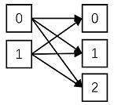
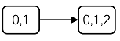
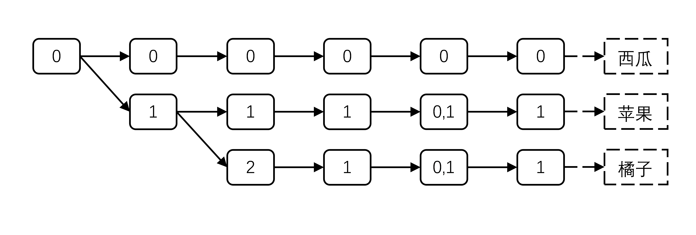
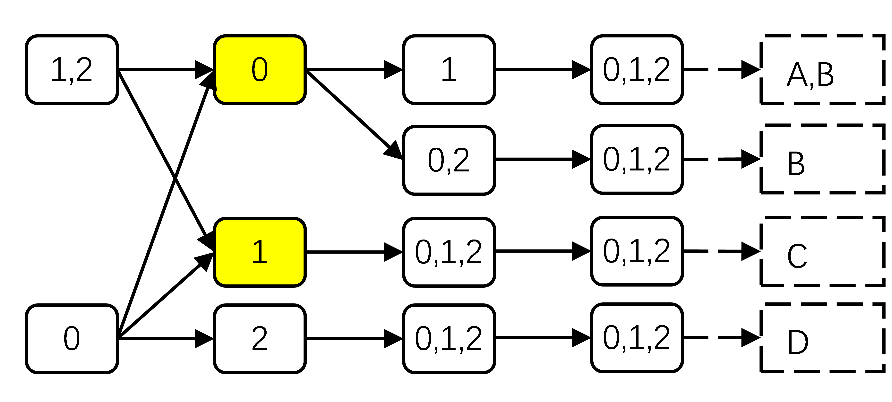
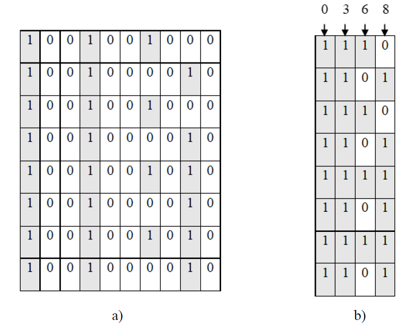
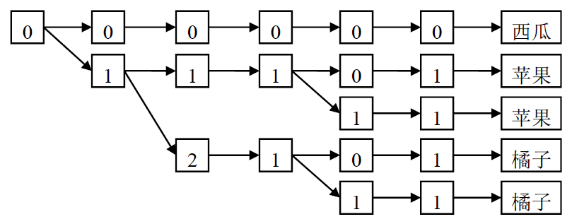
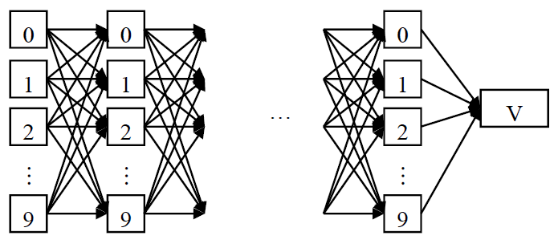
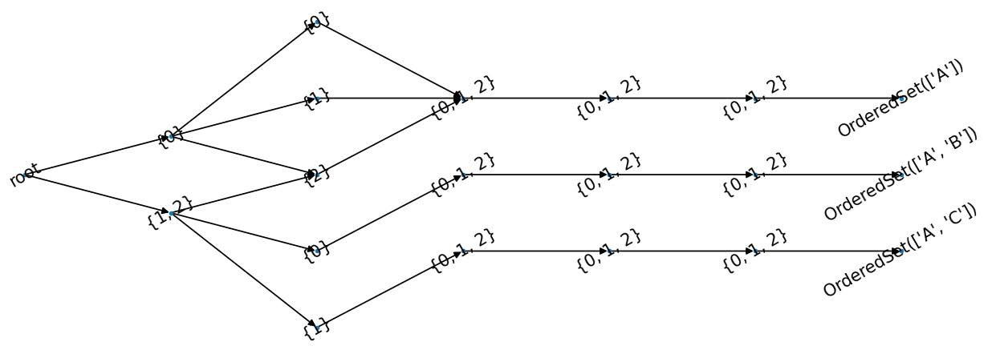

## 稀疏查找表的用处

稀疏查找表(Sparse Look-Up Table, SparseLUT)适用于如下场景：

在一个实际场景中，面临这样一个问题：如何根据一个特征序列，索引到一个值。

例如，

- 特征序列为“**是水果，体积很大，绿色，有条纹，甜，水分多**”，根据这些特征应索引到值“**西瓜**”，
- 特征序列为“**是水果，体积不大，红色，没有条纹，甜或酸，水分适中**”，根据这些特征应索引到值“**苹果**”，
- 特征序列为“**是水果，体积不大，橙色，没有条纹，甜或酸，水分适中**”，根据这些特征应索引到特征“**橘子**”。

如果我们将“**是/不是水果**”用“$0/1$”表示，“**体积很大/不大**”用“$0/1$”表示，“**绿色/红色/橙色**”用“$0/1/2$”表示，“**有条纹/没有条纹**”用“$0/1$”表示，“**甜/酸**”用“$0/1$”表示，“**水分多/适中/少**”用“$0/1/2$”表示，逻辑连词“**或**”连接的特征用一个“**列表**”来表示（例如，“**甜或酸**”表示为$[0,1] $，“**水分多或适中或少**”表示为$[0,1,2] $），特征序列也用“**列表**”来表示，特征序列与其对应的值之间用符号“$\rightarrow $”连接，那么，上面三条特征应该表示为

- $[0,0,0,0,0,0]\rightarrow$ 西瓜，
- $[0,1,1,1,[0,1],1]\rightarrow$ 苹果，
- $[0,1,2,1,[0,1],1]\rightarrow$ 橘子。

那么，当给出特征序列“$[0,1,2,1,0,1]$”时，由于“$[0,1,2,1,[0,1],1]\rightarrow$ 橘子”，我们知道该特征序列对应的值是“橘子”。

稀疏查找表正是用于实现类似上述特征匹配过程的一个工具。形式上说，所面临的问题可抽象为，给定形如

$$\begin{aligned}
&[[f_{11}^{(1)},f_{12}^{(1)},f_{13}^{(1)},...,f_{1n_1^{(1)}}^{(1)}],[f_{21}^{(1)},f_{22}^{(1)},f_{23}^{(1)},...,f_{2n_2^{(1)}}^{(1)}],...,[f_{m1}^{(1)},f_{m2}^{(1)},f_{m3}^{(1)},...,f_{mn_m^{(1)}}^{(1)}]] & \rightarrow V_{(1)}\\
&[[f_{11}^{(2)},f_{12}^{(2)},f_{13}^{(2)},...,f_{1n_1^{(2)}}^{(2)}],[f_{21}^{(2)},f_{22}^{(2)},f_{23}^{(2)},...,f_{2n_2^{(2)}}^{(2)}],...,[f_{m1}^{(2)},f_{m2}^{(2)},f_{m3}^{(2)},...,f_{mn_m^{(2)}}^{(2)}]] & \rightarrow V_{(2)}\\
&...&\\
&[[f_{11}^{(l)},f_{12}^{(l)},f_{13}^{(l)},...,f_{1n_1^{(l)}}^{(l)}],[f_{21}^{(l)},f_{22}^{(l)},f_{23}^{(l)},...,f_{2n_2^{(l)}}^{(l)}],...,[f_{m1}^{(l)},f_{m2}^{(l)},f_{m3}^{(l)},...,f_{mn_m^{(l)}}^{(l)}]] & \rightarrow V_{(l)}\\
\end{aligned}$$

（式1）

的一系列特征序列及其对应的值时，构建一个有向无环图，该图占用尽可能少的存储空间存储数据，并确保在给定形如

$$[f_1,f_2,...,f_m]$$

的特征序列时，计算机通过在该有向无环图上搜索，能在常数时间访问到对应的值。式1中，每一行的右箭头左边的对象被称为“*特征序列*”，右边的对象被称为“*值*”；每个*特征序列*由一系列整数的列表构成，其中的每个列表被称为“*特征列表*”，*特征列表*中的每个整数被称为“*特征*”；*特征序列*和*值*的数量为$l$，每个*特征序列*中，含有$m$个*特征列表*，每个*特征列表*中含有$n$个*特征*；第$i$行的*特征序列*中的第$j$个*特征列表*中所含有的*特征*数量被表示为$n_j^{(i)}$；第$i$ 行的*特征序列*中的第$j$个*特征列表*中的第$k$个*特征*被表示为为$f_{jk}^{(i)}$，且$f_{jk}^{(i)}$ 的取值范围是$\{0,1,2,...,k_{j,max}^{(i)}\}$，其中$k_{j,max}^{(i)}$ 是一个整数，表示第$i$ 行的*特征序列*中的第$j $个*特征列表*中*特征*的最大值。

当一个*特征列表*中的*特征*的数量仅为$1$个时，可省略*特征列表*的方括号得到简化表示，例如，$[[1],[0,1,2],[0],[2]]$的简化表示为$[1,[0,1,2],0,2]$。

## 稀疏查找表的优势

在说明稀疏查找表的优势前，我们首先介绍一种图的简化表示方式。若一组结点与另一组结点之间两两连接，那么，我们可以将每组结点称为一个“结点集”，在图表示中，用一个箭头连接两个结点集对应的结点。例如，结点集$[0,1]$与结点集$[0,1,2]$中的各个结点两两连接，传统的表示方式如下图所示。


图1 

其简化表示为


图2

上面的例子中，若输入为

- $[0,0,0,0,0,0]\rightarrow$ 西瓜，
- $[0,1,1,1,[0,1],1]\rightarrow$ 苹果，
- $[0,1,2,1,[0,1],1]\rightarrow$ 橘子。

其对应稀疏查找表的图表示为


图3

这个例子中，稀疏查找表呈现出了树的结构。然而，稀疏查找表并不一定是树，而通常是有向无环图。例如，若输入为

- $[[0,1,2],0,1,[0,1,2]]\rightarrow A$，
- $[[0,1,2],0,[0,1,2],[0,1,2]]\rightarrow B$，
- $[[0,1,2],1,[0,1,2],[0,1,2]]  \rightarrow C$，
- $[0,2,[0,1,2],[0,1,2]]  \rightarrow D$。

则其对应稀疏查找表的图表示为


图4

可以看出，黄色标记的结点集有多个父节点，这使得该图不是树。

稀疏查找表正是通过尽可能地“复用”结点来节约存储空间的。

为了实现与稀疏查找表相同的功能（即“查找”的功能），最常见的技术方案是使用高维数组来存储一张“查找表”，并将所有可能的特征对应的值存储在数组中，通过数组下标访问的方式来索引值。例如，对于上述水果的例子，须在内存中存储一个形状为$2\times 2\times 3\times 2\times 2\times 3 $的数组，在该数组的$[0,0,0,0,0,0]$位置写入值“西瓜”，在$[0,1,1,1,0,1]$和$[0,1,1,1,1,1]$两个位置写入值“苹果”，在$[0,1,2,1,0,1]$和$[0,1,2,1,1,1]$两个位置写入值“橘子”，其余位置写入值“空”，这样一来，给定另一条特征$[0,1,2,1,0,1]$，通过将该特征作为数组的下标来访问数组，即可索引到正确的值“橘子”。然而，如果实际面临的场景较上述例子场景复杂得多，通过这种“查找表”的方式来索引特征对应的值，计算机内存开销将变得难以接收。

例如，假设我们需要用一个长度为20的列表作为特征序列，用于索引到特定的值，而特征序列中的每个数的取值范围是0至9之间的整数，每个待访问的值的类型是char型（占用1字节内存），则这张查找表将需要$10^{20}$个字节的存储空间，这样天文数字的资源占用在工程中是不可接受的。因此，“查找表”的方法此时就不适用了。而这个场景正是我们工程中实际面临的。

一种改进的存储方式是利用[稀疏表(Sparse Table）](https://brilliant.org/wiki/sparse-table/)来存储。稀疏表是利用数据在某一维度上的稀疏性来压缩数组的存储空间。例如，对于图5a所示的稠密存储的表，由于数据在0、3、6、8列是稠密的，而在其他列都为0，因此可将那些全为0的列抛弃，而只保留含有1的列，并将列标存储下来，得到如图5b所示的稀疏存储的表。


图5

另一种更为通用的稀疏存储方式是利用类似于[前缀树(Trie)](https://en.wikipedia.org/wiki/Trie)来存储。前缀树是一种树状的数据结构，它原本用于字符串匹配。上述场景中，给定多个特征序列，前缀树将那些“前缀”相同的部分合并为一个结点，由此来压缩存储空间，并实现值的常数时间的访问。上述水果的场景对应的前缀树如图6所示（尽管这不是严格的前缀树）。


图6

然而，传统的稀疏表的存储方式，以及前缀树，并不能完全适用于某些场景。例如，如果一个特征是“$[[0,1,2,...,9],[0,1,2,...,9],...,[0,1,2,...,9]]\rightarrow V$”，该特征序列一共有20个特征，每个特征都是$[0,1,2,...,9] $，该特征序列对应了值$V $。如果用稠密的表来存储，则需要$10^{20} $单位存储空间；该例子中，传统的稀疏表是不适用的，因为数据并没有在某些位置是空的、而在少数的位置上是有值的，尽管所有位置上都有值且有相同的值；该例子中，前缀树是不适用的，因为如果用前缀树，则首先需要将特征序列拆分成$10^{20} $条特征序列，然后再构建前缀树，即是成功地拆分并进入前缀树的构建阶段，该前缀树也需要约$10+10^2+10^3+⋯+10^{20} $单位的存储空间来存储所有结点。这些在工程实践中是几乎无法办到的。而采用本发明所涉及的稀疏查找表，该例子只需要约$200 $单位的存储空间来存储所有的结点、约$1900 $单位的存储空间来存储所有的边，如图7所示。稀疏查找表之所以优于前缀树，是因为前缀树通过复用父结点来节约存储空间的，但其子结点并未得到复用，也就是说，所构建的图是严格的树结构，在存储时仍然占用相当一部分冗余的存储空间资源；而稀疏表通过同时复用父结点和复用子结点，形成有向无环图的结构，达到存储空间资源利用的最优化。



图7

## 使用方法

通过以下命令即可安装稀疏查找表的Python包：

```
pip install sparse_lut
```

下面介绍使用稀疏查找表的方法。


首先，通过如下代码初始化稀疏查找表

```Python
from sparse_lut import SparseLUT

# initialization
lut = SparseLUT((3, 3, 3, 3, 3))
```

其次，通过`add`方法，向稀疏查找表中加入多条*特征序列*，例如

```Python
# adding feature-lists
lut.add([[0,1,2], [0,1,2], [0,1,2], [0,1,2], [0,1,2]], "A")
lut.add([[1,2], [0], [0,1,2], [0,1,2], [0,1,2]], "B")
lut.add([[1,2], [1], [0,1,2], [0,1,2], [0,1,2]], "C")
```

第三，构建稀疏查找表。如果要进一步进行可视化，则需要传入参数 `False`，否则，程序构建好后会将相关的中间变量清空，以至于无法进行进一步的可视化。

```Python
# building the sparse-lut
lut.build(False) # set True is visualization is not required 
```

第四，如果需要可视化，则通过`draw`方法进行。 上述例子的可视化结果如图8所示。

图8

第五，通过下标访问。例如

```Python
# accessing the value
result = lut[0,1,0,0,0]
print(result)
```

程序会打印“OrderedSet(['A'])”，即成功访问到了对应的值。